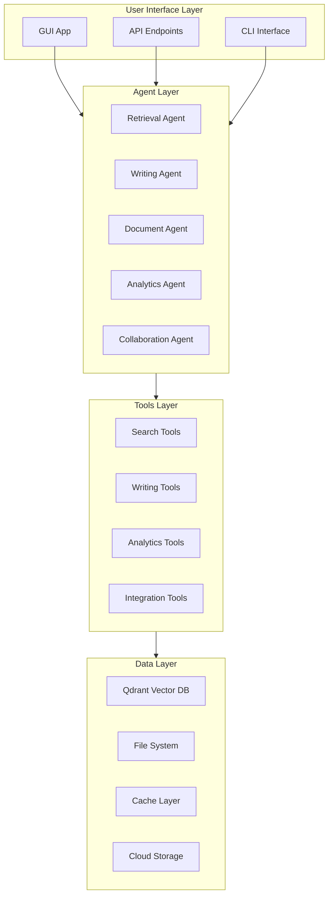

# Comprehensive Feature Implementation Plan

## Overview

This plan covers all recommended features and upgrades for the RAG Chatbot application, organized into 6 priority phases. Each feature includes implementation details, file paths, dependencies, and effort estimates.

## Architecture Overview

## Phase 1: Quick Wins (Week 1-2)

### 1.1 Enhanced Search Filters UI

**Files to modify:**
- `src/gui/app.py` - Add filter panel
- `src/gui/book_browser.py` - Enhance existing filters
- `src/tools/vector_tools.py` - Add filter functions

**Implementation:**
- Add filter panel in sidebar with:
  - Date range picker
  - File type filter (PDF, EPUB, etc.)
  - Author filter dropdown
  - Genre/topic filter
  - Source filter (books vs documents)
- Connect filters to retrieval agent
- Add filter state management

**Effort:** 1-2 days

### 1.2 Export Chat History

**Files to create:**
- `src/tools/export_tools.py` - Export utilities
- `src/gui/export_dialog.py` - Export dialog window

**Files to modify:**
- `src/gui/app.py` - Add export button
- `src/agents/memory_agent.py` - Add export functionality

**Implementation:**
- Add "Export" button in chat interface
- Support formats: Markdown, PDF, JSON, TXT
- Include metadata (timestamps, sources, etc.)
- Add export dialog with format selection

**Effort:** 1 day

### 1.3 Theme Toggle

**Files to modify:**
- `src/gui/app.py` - Add theme toggle
- `src/config/settings.py` - Store theme preference

**Implementation:**
- Add theme toggle button in settings
- Support: Dark, Light, System
- Persist preference in settings
- Apply theme on app startup

**Effort:** 0.5 days

### 1.4 Keyboard Shortcuts

**Files to modify:**
- `src/gui/app.py` - Add keyboard bindings
- `src/config/settings.py` - Store shortcuts config

**Implementation:**
- Add shortcuts:
  - Ctrl+K: Focus search
  - Ctrl+N: New chat
  - Ctrl+S: Save/Export
  - Ctrl+F: Find in chat
  - Ctrl+/: Show shortcuts help
- Add shortcuts help dialog
- Make shortcuts configurable

**Effort:** 1 day

### 1.5 Reading Progress Tracking

**Files to create:**
- `src/tools/reading_tools.py` - Reading progress utilities
- `src/gui/reading_progress.py` - Progress widget

**Files to modify:**
- `src/gui/book_reader.py` - Add progress tracking
- `src/agents/memory_agent.py` - Store progress

**Implementation:**
- Track current page/chapter
- Store progress per book
- Show progress bar in reader
- Resume from last position

**Effort:** 1-2 days

### 1.6 Bookmark System

**Files to create:**
- `src/tools/bookmark_tools.py` - Bookmark management
- `src/gui/bookmark_manager.py` - Bookmark UI

**Files to modify:**
- `src/gui/book_reader.py` - Add bookmark button
- `src/agents/memory_agent.py` - Store bookmarks

**Implementation:**
- Add bookmark button in reader
- Store bookmarks with notes
- Bookmark manager window
- Quick navigation to bookmarks

**Effort:** 1-2 days

### 1.7 Notes and Highlights

**Files to create:**
- `src/tools/annotation_tools.py` - Annotation utilities
- `src/gui/annotation_editor.py` - Annotation UI

**Files to modify:**
- `src/gui/book_reader.py` - Add highlight/note features
- `src/agents/memory_agent.py` - Store annotations

**Implementation:**
- Text selection for highlighting
- Add notes to selections
- View all annotations
- Export annotations

**Effort:** 2-3 days

### 1.8 Quick Actions Menu

**Files to modify:**
- `src/gui/app.py` - Add context menu
- `src/gui/book_browser.py` - Add context menu

**Implementation:**
- Right-click context menu
- Actions: Open, Export, Delete, Properties
- Keyboard shortcuts in menu

**Effort:** 1 day

### 1.9 Enhanced Status Bar

**Files to modify:**
- `src/gui/app.py` - Add status bar
- `src/utils/indexing_progress.py` - Enhance progress info

**Implementation:**
- Status bar at bottom of window
- Show: indexing status, search results count, current operation
- Update in real-time

**Effort:** 0.5 days

### 1.10 Tooltips Throughout UI

**Files to modify:**
- All GUI files - Add tooltips to buttons/controls

**Implementation:**
- Add helpful tooltips to all interactive elements
- Tooltip text in configuration file
- Hover delay and positioning

**Effort:** 1 day

**Phase 1 Total Effort:** 10-14 days

---

## Phase 2: Priority 1 Features (Week 3-6)

### 2.1 Advanced Search - Multi-Query Expansion

**Files to create:**
- `src/tools/query_expansion_tools.py` - Query expansion logic
- `src/agents/query_agent.py` - Query processing agent

**Files to modify:**
- `src/agents/retrieval_agent.py` - Integrate multi-query
- `src/gui/app.py` - Add query expansion toggle

**Implementation:**
- Generate related queries from user query
- Search with all queries
- Merge and deduplicate results
- Rank by relevance across queries

**Effort:** 3-4 days

### 2.2 Citation and Source Tracking

**Files to create:**
- `src/tools/citation_tools.py` - Citation generation
- `src/gui/citation_viewer.py` - Citation display

**Files to modify:**
- `src/agents/retrieval_agent.py` - Add citation metadata
- `src/gui/app.py` - Display citations in chat

**Implementation:**
- Extract source file, page, chapter from chunks
- Generate citations in responses
- Clickable citations to source
- Citation format options (APA, MLA, etc.)

**Effort:** 3-4 days

### 2.3 Search History and Saved Searches

**Files to create:**
- `src/tools/search_history_tools.py` - History management
- `src/gui/search_history.py` - History UI

**Files to modify:**
- `src/agents/retrieval_agent.py` - Log searches
- `src/gui/app.py` - Add history panel

**Implementation:**
- Store search queries with results
- Save favorite searches
- Replay searches
- Search within history

**Effort:** 2-3 days

### 2.4 Query Suggestions and Autocomplete

**Files to create:**
- `src/tools/autocomplete_tools.py` - Autocomplete logic
- `src/gui/autocomplete_widget.py` - Autocomplete UI

**Files to modify:**
- `src/gui/app.py` - Add autocomplete to search
- `src/agents/retrieval_agent.py` - Generate suggestions

**Implementation:**
- Autocomplete based on indexed content
- Related query suggestions
- Popular searches
- Recent searches dropdown

**Effort:** 2-3 days

### 2.5 Enhanced Writing - Collaborative Editing

**Files to create:**
- `src/tools/collaboration_tools.py` - Collaboration utilities
- `src/agents/collaboration_agent.py` - Collaboration agent
- `src/gui/collaboration_panel.py` - Collaboration UI

**Files to modify:**
- `src/gui/writing_interface.py` - Add collaboration features
- `src/agents/project_agent.py` - Multi-user support

**Implementation:**
- Real-time editing with conflict resolution
- User presence indicators
- Comments and suggestions
- Change tracking

**Effort:** 5-7 days

### 2.6 Writing - Version Control Integration

**Files to create:**
- `src/tools/version_control_tools.py` - Version control
- `src/gui/version_history.py` - Version history UI

**Files to modify:**
- `src/agents/project_agent.py` - Version management
- `src/gui/writing_interface.py` - Version controls

**Implementation:**
- Git-like branching/merging
- Version history viewer
- Diff viewer
- Rollback functionality

**Effort:** 4-5 days

### 2.7 Writing - AI-Powered Editing

**Files to create:**
- `src/tools/ai_editing_tools.py` - AI editing utilities
- `src/agents/editing_agent.py` - Editing agent

**Files to modify:**
- `src/gui/writing_interface.py` - Add editing suggestions
- `src/agents/writing_agent.py` - Integrate editing

**Implementation:**
- Grammar checking
- Style suggestions
- Consistency checking
- Inline suggestions UI

**Effort:** 4-5 days

### 2.8 Writing - Template Library

**Files to create:**
- `src/tools/template_tools.py` - Template management
- `src/gui/template_library.py` - Template browser
- `data/templates/` - Template files directory

**Files to modify:**
- `src/gui/writing_interface.py` - Add template selection
- `src/agents/writing_agent.py` - Use templates

**Implementation:**
- Genre-specific templates
- Custom template creation
- Template variables
- Template preview

**Effort:** 2-3 days

### 2.9 Enhanced Export Formats

**Files to modify:**
- `src/tools/writing_tools.py` - Add export functions
- `src/gui/writing_interface.py` - Add export options

**Implementation:**
- PDF export (with formatting)
- HTML export
- LaTeX export
- Custom format support

**Effort:** 3-4 days

### 2.10 Search Within Chat

**Files to modify:**
- `src/gui/app.py` - Add find in chat
- `src/agents/memory_agent.py` - Chat search

**Implementation:**
- Find dialog (Ctrl+F)
- Search within current conversation
- Search all conversations
- Highlight matches

**Effort:** 1-2 days

### 2.11 Export Conversations

**Files to modify:**
- `src/tools/export_tools.py` - Add conversation export
- `src/gui/app.py` - Add export menu

**Implementation:**
- Export current conversation
- Export all conversations
- Formats: PDF, Markdown, JSON
- Include metadata

**Effort:** 1 day

### 2.12 Customizable UI Layout

**Files to modify:**
- `src/gui/app.py` - Add layout management
- `src/config/settings.py` - Store layouts

**Implementation:**
- Resizable panels
- Save/load layouts
- Layout presets
- Drag-and-drop panel arrangement

**Effort:** 3-4 days

**Phase 2 Total Effort:** 35-50 days

---

## Phase 3: Priority 2 Features (Week 7-12)

### 3.1 Knowledge Graph and Entity Relationships

**Files to create:**
- `src/tools/knowledge_graph_tools.py` - Graph utilities
- `src/agents/knowledge_graph_agent.py` - Graph agent
- `src/gui/knowledge_graph_viewer.py` - Graph visualization
- `src/tools/graph_visualization.py` - Visualization engine

**Files to modify:**
- `src/tools/entity_extraction_tools.py` - Enhance entity extraction
- `src/agents/retrieval_agent.py` - Add relationship search

**Implementation:**
- Extract entity relationships from documents
- Build knowledge graph
- Interactive graph visualization
- Relationship queries
- Graph export

**Effort:** 7-10 days

### 3.2 Concept Maps

**Files to create:**
- `src/tools/concept_map_tools.py` - Concept mapping
- `src/gui/concept_map_editor.py` - Concept map UI

**Implementation:**
- Auto-generate concept maps
- Manual concept map editing
- Concept map export
- Concept-based search

**Effort:** 5-7 days

### 3.3 Cross-Reference Explorer

**Files to create:**
- `src/tools/cross_reference_tools.py` - Cross-reference utilities
- `src/gui/cross_reference_viewer.py` - Cross-reference UI

**Files to modify:**
- `src/agents/retrieval_agent.py` - Find references
- `src/gui/book_reader.py` - Show references

**Implementation:**
- Find all references to entity/concept
- Navigate between references
- Reference graph
- Reference statistics

**Effort:** 4-5 days

### 3.4 Timeline View

**Files to create:**
- `src/tools/timeline_tools.py` - Timeline utilities
- `src/gui/timeline_viewer.py` - Timeline UI

**Implementation:**
- Extract dates from documents
- Create timeline visualization
- Filter by date range
- Timeline export

**Effort:** 3-4 days

### 3.5 Document Analytics Dashboard

**Files to create:**
- `src/tools/analytics_tools.py` - Analytics utilities
- `src/agents/analytics_agent.py` - Analytics agent
- `src/gui/analytics_dashboard.py` - Dashboard UI

**Files to modify:**
- `src/agents/document_agent.py` - Collect statistics
- `src/main.py` - Initialize analytics

**Implementation:**
- Document statistics (count, size, types)
- Coverage analysis
- Topic distribution
- Usage statistics
- Interactive charts

**Effort:** 5-7 days

### 3.6 Reading Insights

**Files to create:**
- `src/tools/reading_analytics_tools.py` - Reading analytics
- `src/gui/reading_insights.py` - Insights UI

**Files to modify:**
- `src/tools/reading_tools.py` - Track reading metrics
- `src/gui/book_reader.py` - Collect metrics

**Implementation:**
- Reading time tracking
- Progress visualization
- Reading speed analysis
- Highlights/notes statistics

**Effort:** 3-4 days

### 3.7 Writing Analytics

**Files to create:**
- `src/tools/writing_analytics_tools.py` - Writing analytics
- `src/gui/writing_analytics.py` - Analytics UI

**Files to modify:**
- `src/agents/writing_agent.py` - Track metrics
- `src/gui/writing_interface.py` - Display metrics

**Implementation:**
- Word count tracking
- Style metrics (readability, tone)
- Writing speed
- Productivity charts

**Effort:** 3-4 days

### 3.8 Usage Statistics

**Files to create:**
- `src/tools/usage_tracking_tools.py` - Usage tracking
- `src/gui/usage_statistics.py` - Statistics UI

**Files to modify:**
- `src/agents/retrieval_agent.py` - Track searches
- `src/main.py` - Initialize tracking

**Implementation:**
- Most searched topics
- Popular books/documents
- Feature usage
- Time-based trends

**Effort:** 3-4 days

### 3.9 Compliance Dashboard

**Files to create:**
- `src/tools/compliance_dashboard_tools.py` - Dashboard utilities
- `src/gui/compliance_dashboard.py` - Dashboard UI

**Files to modify:**
- `src/agents/compliance_tagging_agent.py` - Aggregate data
- `src/agents/reach_extraction_agent.py` - Status tracking

**Implementation:**
- Compliance status overview
- Regulation coverage
- Compliance alerts
- Status by category

**Effort:** 4-5 days

### 3.10 Automated Compliance Checking

**Files to create:**
- `src/tools/compliance_checker_tools.py` - Compliance checking
- `src/agents/compliance_checker_agent.py` - Checker agent

**Files to modify:**
- `src/agents/document_agent.py` - Auto-check on index
- `src/gui/app.py` - Show compliance status

**Implementation:**
- Scan documents for compliance issues
- Generate compliance reports
- Alert on violations
- Compliance scoring

**Effort:** 5-7 days

### 3.11 Regulatory Update Notifications

**Files to create:**
- `src/tools/regulatory_update_tools.py` - Update tracking
- `src/agents/regulatory_update_agent.py` - Update agent
- `src/gui/regulatory_updates.py` - Updates UI

**Implementation:**
- Monitor regulatory sources
- Detect changes
- Notify users
- Update compliance status

**Effort:** 4-5 days

### 3.12 Compliance Report Generator

**Files to create:**
- `src/tools/compliance_report_tools.py` - Report generation
- `src/gui/compliance_report_editor.py` - Report UI

**Implementation:**
- Generate compliance reports
- Custom report templates
- Export reports (PDF, DOCX)
- Scheduled reports

**Effort:** 3-4 days

**Phase 3 Total Effort:** 50-70 days

---

## Phase 4: Performance and Optimization (Week 13-16)

### 4.1 Caching System

**Files to create:**
- `src/utils/cache_manager.py` - Cache management
- `src/utils/embedding_cache.py` - Embedding cache
- `src/utils/query_cache.py` - Query cache

**Files to modify:**
- `src/tools/embedding_tools.py` - Use cache
- `src/agents/retrieval_agent.py` - Use query cache

**Implementation:**
- Cache embeddings (LRU cache)
- Cache query results
- Cache configuration
- Cache invalidation

**Effort:** 4-5 days

### 4.2 Lazy Loading

**Files to modify:**
- `src/gui/book_reader.py` - Lazy load pages
- `src/gui/book_browser.py` - Lazy load book list
- `src/agents/document_agent.py` - Lazy load documents

**Implementation:**
- Load content on demand
- Virtual scrolling
- Progressive loading
- Loading indicators

**Effort:** 3-4 days

### 4.3 Batch Operations

**Files to create:**
- `src/tools/batch_tools.py` - Batch utilities
- `src/gui/batch_operations.py` - Batch UI

**Files to modify:**
- `src/agents/document_agent.py` - Batch processing
- `src/agents/retrieval_agent.py` - Batch indexing

**Implementation:**
- Bulk import/export
- Batch delete
- Batch tagging
- Progress tracking

**Effort:** 3-4 days

### 4.4 Query Optimization

**Files to modify:**
- `src/agents/retrieval_agent.py` - Optimize queries
- `src/tools/vector_tools.py` - Optimize search

**Implementation:**
- Query result caching
- Query plan optimization
- Parallel query execution
- Query performance monitoring

**Effort:** 3-4 days

### 4.5 Incremental Index Updates

**Files to modify:**
- `src/agents/document_agent.py` - Detect changes
- `src/agents/retrieval_agent.py` - Incremental indexing
- `src/utils/indexing_progress.py` - Track updates

**Implementation:**
- File change detection
- Update only changed files
- Smart re-indexing
- Update progress tracking

**Effort:** 4-5 days

### 4.6 Smart Re-indexing

**Files to create:**
- `src/tools/reindexing_tools.py` - Re-indexing logic
- `src/gui/reindexing_dialog.py` - Re-indexing UI

**Files to modify:**
- `src/agents/document_agent.py` - Change detection
- `src/main.py` - Re-indexing trigger

**Implementation:**
- Detect file changes
- Selective re-indexing
- Re-indexing scheduler
- Re-indexing progress

**Effort:** 3-4 days

### 4.7 Index Optimization

**Files to create:**
- `src/tools/index_optimization_tools.py` - Optimization utilities
- `src/gui/index_optimization.py` - Optimization UI

**Files to modify:**
- `src/tools/vector_tools.py` - Optimization functions
- `src/main.py` - Optimization trigger

**Implementation:**
- Index compression
- Duplicate removal
- Index defragmentation
- Optimization scheduling

**Effort:** 4-5 days

### 4.8 Multi-Collection Support

**Files to modify:**
- `src/tools/vector_tools.py` - Multi-collection support
- `src/config/settings.py` - Collection configuration
- `src/agents/retrieval_agent.py` - Collection selection

**Implementation:**
- Separate collections by type
- Collection management UI
- Cross-collection search
- Collection statistics

**Effort:** 5-6 days

### 4.9 Model Quantization

**Files to modify:**
- `src/tools/model_manager.py` - Quantization support
- `src/config/settings.py` - Quantization config

**Implementation:**
- Quantize models on load
- Quantization options
- Performance vs quality tradeoff
- Quantization benchmarking

**Effort:** 3-4 days

### 4.10 Model Caching

**Files to modify:**
- `src/tools/model_manager.py` - Model caching
- `src/config/settings.py` - Cache config

**Implementation:**
- Cache loaded models
- Model preloading
- Cache eviction policy
- Cache statistics

**Effort:** 2-3 days

### 4.11 Adaptive Model Selection

**Files to create:**
- `src/tools/model_selector_tools.py` - Model selection logic
- `src/agents/model_selector_agent.py` - Selection agent

**Files to modify:**
- `src/tools/model_manager.py` - Adaptive selection
- `src/agents/router_agent.py` - Use adaptive selection

**Implementation:**
- Select model by task complexity
- Performance monitoring
- Automatic model switching
- Selection metrics

**Effort:** 4-5 days

### 4.12 Model Performance Monitoring

**Files to create:**
- `src/tools/model_monitoring_tools.py` - Monitoring utilities
- `src/gui/model_monitoring.py` - Monitoring UI

**Files to modify:**
- `src/tools/model_manager.py` - Track metrics
- `src/tools/llm_tools.py` - Log performance

**Implementation:**
- Track model performance
- Latency monitoring
- Quality metrics
- Performance dashboard

**Effort:** 3-4 days

**Phase 4 Total Effort:** 40-55 days

---

## Phase 5: Integration and Extensibility (Week 17-22)

### 5.1 REST API Endpoints

**Files to create:**
- `src/api/` - API package
- `src/api/server.py` - FastAPI server
- `src/api/routes/` - API routes directory
- `src/api/routes/search.py` - Search endpoints
- `src/api/routes/books.py` - Book endpoints
- `src/api/routes/writing.py` - Writing endpoints
- `src/api/routes/analytics.py` - Analytics endpoints
- `src/api/models.py` - API models/schemas
- `src/api/auth.py` - Authentication middleware

**Files to modify:**
- `src/main.py` - Start API server option
- `requirements.txt` - Add FastAPI, uvicorn

**Implementation:**
- FastAPI server setup
- RESTful endpoints for all major features
- Authentication (API keys, OAuth)
- Request/response validation
- API documentation (Swagger/OpenAPI)
- Rate limiting
- Error handling

**Endpoints to implement:**
- POST /api/v1/search - Semantic search
- GET /api/v1/books - List books
- GET /api/v1/books/{id} - Get book details
- POST /api/v1/writing/generate - Generate content
- GET /api/v1/analytics/dashboard - Analytics data

**Effort:** 7-10 days

### 5.2 Webhooks System

**Files to create:**
- `src/tools/webhook_tools.py` - Webhook utilities
- `src/api/routes/webhooks.py` - Webhook endpoints
- `src/agents/webhook_agent.py` - Webhook agent

**Files to modify:**
- `src/agents/document_agent.py` - Trigger webhooks
- `src/agents/retrieval_agent.py` - Trigger webhooks

**Implementation:**
- Webhook registration
- Event types (indexing complete, search, etc.)
- Webhook delivery with retries
- Webhook management UI
- Security (signatures, validation)

**Effort:** 4-5 days

### 5.3 Plugin System

**Files to create:**
- `src/plugins/` - Plugin package
- `src/plugins/plugin_manager.py` - Plugin manager
- `src/plugins/plugin_base.py` - Base plugin class
- `src/plugins/plugin_registry.py` - Plugin registry
- `src/gui/plugin_manager_ui.py` - Plugin management UI

**Files to modify:**
- `src/main.py` - Load plugins on startup
- `src/bmad/framework.py` - Plugin integration

**Implementation:**
- Plugin discovery and loading
- Plugin API/interface
- Plugin lifecycle management
- Plugin configuration
- Plugin marketplace (future)
- Security sandboxing

**Effort:** 7-10 days

### 5.4 Enhanced Import/Export Formats

**Files to create:**
- `src/tools/format_converters.py` - Format conversion utilities

**Files to modify:**
- `src/tools/export_tools.py` - Add new formats
- `src/tools/writing_tools.py` - Enhanced export

**Implementation:**
- Additional formats: RTF, ODT, TXT, CSV
- Batch format conversion
- Format validation
- Metadata preservation
- Custom format templates

**Effort:** 3-4 days

### 5.5 Cloud Backup Integration

**Files to create:**
- `src/tools/cloud_backup_tools.py` - Cloud backup utilities
- `src/agents/backup_agent.py` - Backup agent
- `src/gui/backup_settings.py` - Backup UI

**Files to modify:**
- `src/config/settings.py` - Backup configuration
- `src/main.py` - Initialize backup agent

**Implementation:**
- Support for: AWS S3, Google Drive, Dropbox, OneDrive
- Automatic backup scheduling
- Incremental backups
- Backup restoration
- Backup encryption

**Effort:** 5-7 days

### 5.6 Multi-Device Sync

**Files to create:**
- `src/tools/sync_tools.py` - Sync utilities
- `src/agents/sync_agent.py` - Sync agent
- `src/gui/sync_settings.py` - Sync UI

**Files to modify:**
- `src/agents/memory_agent.py` - Sync chat history
- `src/agents/project_agent.py` - Sync projects

**Implementation:**
- Conflict resolution
- Sync status indicators
- Selective sync
- Sync history
- Offline mode support

**Effort:** 6-8 days

### 5.7 Offline Mode

**Files to create:**
- `src/tools/offline_tools.py` - Offline utilities
- `src/gui/offline_indicator.py` - Offline status UI

**Files to modify:**
- `src/main.py` - Offline detection
- `src/agents/retrieval_agent.py` - Offline search
- `src/gui/app.py` - Offline UI adaptations

**Implementation:**
- Offline detection
- Local data access
- Queue operations for sync
- Offline indicator
- Graceful degradation

**Effort:** 4-5 days

### 5.8 Version History System

**Files to create:**
- `src/tools/version_history_tools.py` - Version management
- `src/gui/version_history_viewer.py` - Version UI

**Files to modify:**
- `src/agents/document_agent.py` - Track versions
- `src/agents/project_agent.py` - Document versions

**Implementation:**
- Automatic versioning
- Version comparison
- Version restoration
- Version metadata
- Version cleanup policies

**Effort:** 4-5 days

**Phase 5 Total Effort:** 40-54 days

---

## Phase 6: Advanced AI/ML Features (Week 23-28)

### 6.1 Multi-Modal Support

**Files to create:**
- `src/tools/multimodal_tools.py` - Multi-modal utilities
- `src/agents/multimodal_agent.py` - Multi-modal agent
- `src/gui/multimodal_viewer.py` - Multi-modal UI

**Files to modify:**
- `src/agents/retrieval_agent.py` - Image search
- `src/tools/vector_tools.py` - Multi-modal embeddings

**Implementation:**
- Image processing and indexing
- Image search capabilities
- Audio processing (future)
- Video processing (future)
- Multi-modal RAG

**Effort:** 8-12 days

### 6.2 Voice Interface

**Files to create:**
- `src/tools/voice_tools.py` - Voice utilities
- `src/agents/voice_agent.py` - Voice agent
- `src/gui/voice_interface.py` - Voice UI

**Files to modify:**
- `src/gui/app.py` - Voice input/output
- `src/agents/router_agent.py` - Voice routing

**Implementation:**
- Speech-to-text (STT)
- Text-to-speech (TTS)
- Voice commands
- Voice responses
- Wake word detection

**Effort:** 6-8 days

### 6.3 Translation Support

**Files to create:**
- `src/tools/translation_tools.py` - Translation utilities
- `src/agents/translation_agent.py` - Translation agent
- `src/gui/translation_settings.py` - Translation UI

**Files to modify:**
- `src/agents/retrieval_agent.py` - Multi-language search
- `src/gui/app.py` - Translation toggle

**Implementation:**
- Multi-language document support
- Automatic translation
- Language detection
- Translation quality metrics
- Language-specific indexing

**Effort:** 5-7 days

### 6.4 Automatic Summarization

**Files to create:**
- `src/tools/summarization_tools.py` - Summarization utilities
- `src/agents/summarization_agent.py` - Summarization agent

**Files to modify:**
- `src/gui/book_reader.py` - Show summaries
- `src/agents/retrieval_agent.py` - Include summaries

**Implementation:**
- Document summarization
- Chapter summaries
- Custom summary length
- Summary quality metrics
- Batch summarization

**Effort:** 4-5 days

### 6.5 Personalization Engine

**Files to create:**
- `src/tools/personalization_tools.py` - Personalization utilities
- `src/agents/personalization_agent.py` - Personalization agent
- `src/gui/user_profile.py` - User profile UI

**Files to modify:**
- `src/agents/retrieval_agent.py` - Personalized results
- `src/agents/router_agent.py` - User preferences

**Implementation:**
- User behavior tracking
- Preference learning
- Personalized recommendations
- Adaptive UI
- User profiles

**Effort:** 6-8 days

### 6.6 Recommendation System

**Files to create:**
- `src/tools/recommendation_tools.py` - Recommendation utilities
- `src/agents/recommendation_agent.py` - Recommendation agent
- `src/gui/recommendations_panel.py` - Recommendations UI

**Files to modify:**
- `src/gui/book_browser.py` - Show recommendations
- `src/agents/retrieval_agent.py` - Related content

**Implementation:**
- Content-based recommendations
- Collaborative filtering
- Similarity-based suggestions
- Recommendation explanations
- Feedback loop

**Effort:** 5-7 days

### 6.7 Custom AI Assistants

**Files to create:**
- `src/tools/assistant_tools.py` - Assistant utilities
- `src/agents/assistant_agent.py` - Assistant agent
- `src/gui/assistant_creator.py` - Assistant creation UI

**Files to modify:**
- `src/agents/router_agent.py` - Assistant routing
- `src/config/settings.py` - Assistant configs

**Implementation:**
- Assistant creation interface
- Custom prompts and behaviors
- Assistant templates
- Assistant sharing
- Assistant marketplace

**Effort:** 7-10 days

### 6.8 Advanced Entity Extraction

**Files to modify:**
- `src/tools/entity_extraction_tools.py` - Enhanced extraction
- `src/agents/document_agent.py` - Improved NER

**Implementation:**
- Enhanced NER models
- Relationship extraction
- Entity linking
- Entity disambiguation
- Custom entity types

**Effort:** 4-6 days

**Phase 6 Total Effort:** 45-63 days

---

## Implementation Summary

### Total Effort Estimate

- **Phase 1 (Quick Wins):** 10-14 days
- **Phase 2 (Priority 1):** 35-50 days
- **Phase 3 (Priority 2):** 50-70 days
- **Phase 4 (Performance):** 40-55 days
- **Phase 5 (Integration):** 40-54 days
- **Phase 6 (Advanced AI):** 45-63 days

**Grand Total:** 220-306 days (approximately 11-15 months for a single developer)

### Dependencies

**Critical Dependencies:**
- FastAPI (for REST API)
- NetworkX or similar (for knowledge graphs)
- Matplotlib/Plotly (for visualizations)
- Additional LLM models (for specialized tasks)

**Optional Dependencies:**
- WebRTC libraries (for collaboration)
- Cloud SDKs (for backup/sync)
- Speech recognition libraries (for voice)

### Risk Assessment

**High Risk:**
- Collaborative editing (complex conflict resolution)
- Multi-device sync (data consistency)
- Plugin system (security concerns)

**Medium Risk:**
- Knowledge graph (performance at scale)
- Multi-modal support (model availability)
- Voice interface (accuracy and latency)

**Low Risk:**
- UI enhancements
- Export formats
- Analytics dashboards

### Success Criteria

**Phase 1:**
- All quick wins implemented and tested
- UI improvements visible and functional
- User feedback positive

**Phase 2:**
- Core search and writing features enhanced
- Citation system working
- Collaboration features functional

**Phase 3:**
- Knowledge graph operational
- Analytics dashboards providing insights
- Compliance features integrated

**Phase 4:**
- Performance improvements measurable
- Caching reducing load times
- Index optimization working

**Phase 5:**
- API endpoints documented and tested
- Plugin system extensible
- Cloud sync functional

**Phase 6:**
- Multi-modal features working
- Personalization improving UX
- Advanced AI features integrated

### Next Steps

1. Review and prioritize features based on user needs
2. Set up project tracking (GitHub Issues, project board)
3. Begin Phase 1 implementation
4. Establish testing and QA processes
5. Set up CI/CD pipeline
6. Create user documentation

### Notes

- Features can be implemented in parallel where dependencies allow
- Some features may be simplified for MVP and enhanced later
- User feedback should guide prioritization adjustments
- Performance optimizations should be measured and validated
- Security reviews needed for API, plugins, and cloud features

