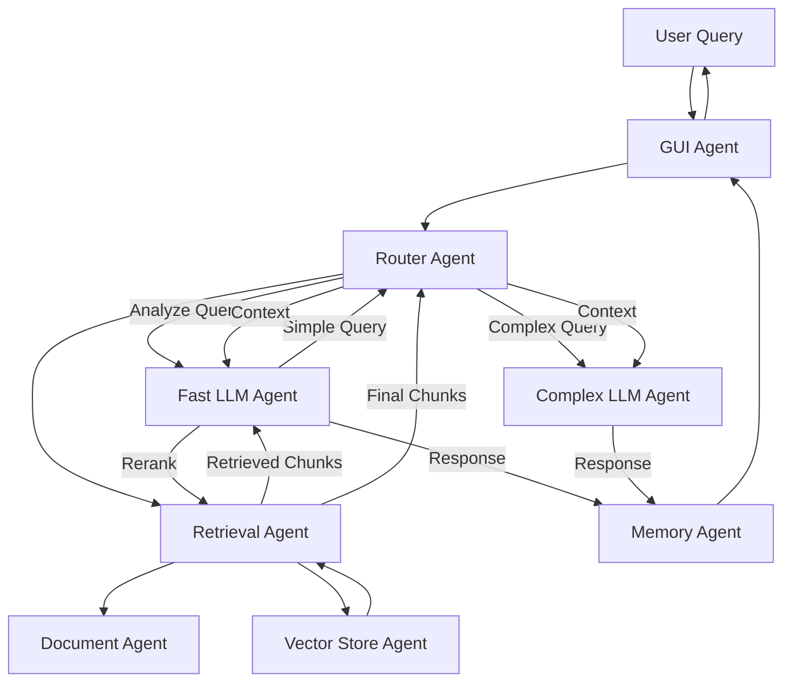

# RAG Chatbot with Markdown Sources

## Architecture Overview

The chatbot will use **BMAD (Breakthrough Method for Agile AI-Driven Development)** framework with a RAG (Retrieval-Augmented Generation) architecture:

### BMAD Agent-Based Architecture

- **Specialized Agents**: Each component is an agent with specific roles, tools, and constraints
- **Agent Collaboration**: Agents communicate and coordinate through BMAD's planning system
- **Memory Management**: BMAD's memory system for context retention and chat history
- **Tool Integration**: Custom tools for document processing, retrieval, and LLM interactions

**Note**: BMAD framework availability may vary. If a Python package doesn't exist, we'll implement a lightweight BMAD-inspired agent framework with:

- Agent base class with role/tool/constraint definitions
- Agent registry and communication system
- Memory management for context retention
- Planning system for agent coordination

### Core Components

- **Document Processing Agent**: Extract and process Markdown files from zip archives
- **Vector Store Agent**: Manage Qdrant for embedding storage and retrieval
- **Retrieval Agent**: Handle multiple retrieval strategies (semantic, hybrid, reranking)
- **Fast LLM Agent**: Handle simple, factual queries with lightweight models
- **Complex LLM Agent**: Handle multi-step reasoning with complex models
- **Router Agent**: Coordinate between agents and route queries appropriately
- **GUI Agent**: Manage user interface and interactions
- **Memory Agent**: Manage chat history and context persistence

### BMAD Benefits

- **Modular Design**: Each agent is independently testable and maintainable
- **Scalability**: Easy to add new agents or capabilities
- **Context Awareness**: BMAD's memory system maintains conversation context
- **Flexible Integration**: Support for multiple LLM providers through agent abstraction

## Project Structure

```
basicbot/
├── src/
│   ├── __init__.py
│   ├── main.py                 # Entry point & BMAD orchestrator
│   ├── bmad/
│   │   ├── __init__.py
│   │   ├── framework.py        # BMAD framework integration
│   │   ├── agent_base.py       # Base agent class
│   │   └── memory.py           # BMAD memory system
│   ├── agents/
│   │   ├── __init__.py
│   │   ├── document_agent.py   # Document processing agent
│   │   ├── retrieval_agent.py  # Retrieval strategies agent
│   │   ├── fast_llm_agent.py   # Fast LLM agent
│   │   ├── complex_llm_agent.py # Complex LLM agent
│   │   ├── router_agent.py     # Query routing agent
│   │   ├── gui_agent.py        # GUI management agent
│   │   └── memory_agent.py     # Chat history agent
│   ├── tools/
│   │   ├── __init__.py
│   │   ├── document_tools.py   # MD extraction & parsing tools
│   │   ├── chunking_tools.py   # Hybrid chunking tools
│   │   ├── embedding_tools.py  # Hugging Face embedding tools
│   │   ├── vector_tools.py     # Qdrant vector store tools
│   │   └── llm_tools.py        # LLM interaction tools
│   ├── gui/
│   │   ├── __init__.py
│   │   ├── app.py              # Main GUI application
│   │   ├── chat_window.py      # Chat interface
│   │   └── settings_window.py  # Model selection & settings
│   ├── config/
│   │   ├── __init__.py
│   │   ├── settings.py         # Configuration management
│   │   └── models_config.json  # Available LLM models
│   └── utils/
│       ├── __init__.py
│       └── file_watcher.py     # Auto-detect MD file changes
├── data/
│   ├── extracted_docs/          # Extracted MD files
│   ├── vector_db/               # Qdrant database
│   └── chat_history/            # Saved conversations (via BMAD memory)
├── requirements.txt
├── README.md
└── .env.example
```

## Key Components

### 1. LLM Model Registry (`src/llm/models.py`)

- Registry of free/open-source LLM options:
  - **Ollama models**: Llama 3.2 (1B, 3B), Phi-3, Mistral 7B, Mixtral 8x7B
  - **Hugging Face**: Zephyr, Gemma, Qwen, etc.
  - **Local transformers**: Support for local model loading
- IDE-style selection interface in GUI
- Model metadata (speed, complexity, use case)

### 2. Dual LLM Router (`src/llm/router.py`)

- **Fast LLM**: Handles simple, factual queries
- **Complex LLM**: Handles multi-step reasoning, complex questions
- Automatic routing based on query complexity (heuristic or fast LLM classification)
- Fallback mechanism if fast LLM can't answer

### 3. Document Processing (`src/rag/document_processor.py`)

- Extract Markdown files from `docs.zip` and `database_docs.zip`
- Parse Markdown structure (headers, sections, code blocks)
- Track file modifications for auto-reindexing

### 4. Hybrid Chunking (`src/rag/chunking.py`)

- Structure-aware: Split by headers/sections
- Size limits: Max tokens per chunk with overlap
- Preserve context: Maintain parent section info

### 5. Retrieval System (`src/rag/retrieval.py`)

- **Semantic Search**: Vector similarity search in Qdrant
- **Hybrid Search**: Combine semantic + BM25 keyword search
- **Reranking**: Use fast LLM to rerank retrieved chunks
- User-selectable strategy in GUI

### 6. GUI Application (`src/gui/app.py`)

- **CustomTkinter** for modern, native-looking interface
- **Settings Window**: Model selection (fast/complex), embedding model, retrieval strategy
- **Chat Window**: 
  - Streaming response display
  - Source citations with clickable links
  - Chat history sidebar
  - Export conversation option

### 7. Configuration (`src/config/settings.py`)

- GUI-managed settings stored in JSON
- Model configurations, paths, preferences
- Persistent across sessions

### 8. Auto-Update System (`src/utils/file_watcher.py`)

- Monitor extracted MD files for changes
- Auto-trigger re-indexing when files are modified
- Background processing with progress indicator

## Implementation Details

### Dependencies

- `bmad` or `bmad-framework`: BMAD framework library (check availability/installation)
- `qdrant-client`: Vector database
- `sentence-transformers`: Hugging Face embeddings
- `langchain`: RAG framework utilities (optional, can use BMAD's tool system)
- `ollama`: Ollama client (if using Ollama)
- `transformers`: Hugging Face models
- `customtkinter`: Modern GUI
- `markdown`: MD parsing
- `watchdog`: File monitoring
- `pydantic`: For agent configuration and validation

### BMAD Agent Flow



### Retrieval Flow (Agent-Based)

1. **GUI Agent** receives user query
2. **Router Agent** analyzes query complexity
3. **Retrieval Agent** embeds query and searches Qdrant (via Vector Store Agent)
4. **Fast LLM Agent** optionally reranks results
5. **Router Agent** routes to Fast or Complex LLM Agent with context
6. **LLM Agent** generates response with retrieved context
7. **Memory Agent** stores interaction in BMAD memory
8. **GUI Agent** streams response to user with source citations

### Dual LLM Routing Logic

- **Fast LLM**: Direct factual questions, simple lookups, definitions
- **Complex LLM**: Multi-step reasoning, comparisons, analysis, synthesis
- Classification: Use fast LLM to classify query complexity, or use heuristics (query length, keywords)

## Features

✅ Extract MD files from zip archives

✅ Hybrid chunking (structure + size)

✅ Multiple retrieval strategies

✅ Dual LLM system (fast + complex)

✅ IDE-style model selection

✅ GUI with streaming responses

✅ Source citations

✅ Chat history persistence

✅ Auto-reindexing on file changes

✅ Configurable via GUI settings

## Configuration File Structure

```json
{
  "fast_llm": {
    "provider": "ollama",
    "model": "llama3.2:1b",
    "endpoint": "http://localhost:11434"
  },
  "complex_llm": {
    "provider": "ollama", 
    "model": "mixtral:8x7b",
    "endpoint": "http://localhost:11434"
  },
  "embedding_model": "sentence-transformers/all-MiniLM-L6-v2",
  "retrieval_strategy": "hybrid",
  "chunk_size": 500,
  "chunk_overlap": 50,
  "top_k": 5
}
```

## Initial Setup Flow

1. **BMAD Framework Initialization**:

   - Initialize BMAD framework
   - Register all agents with their roles and tools
   - Set up agent communication channels
   - Configure BMAD memory system

2. **User Configuration** (via GUI Agent):

   - Fast LLM selection (from available free models)
   - Complex LLM selection
   - Embedding model preference
   - Retrieval strategy preference
   - Path to zip files (or auto-detect)

3. **Document Processing** (Document Agent):

   - Extract MD files from zips
   - Process and chunk documents using hybrid strategy
   - Coordinate with Vector Store Agent

4. **Vector Store Setup** (Vector Store Agent):

   - Generate embeddings using Hugging Face models
   - Store in Qdrant database
   - Index for retrieval

5. **Agent Activation**:

   - Activate all agents in BMAD framework
   - Establish agent communication
   - Launch GUI Agent with chat interface

## BMAD Development Methodology

Following BMAD's development approach:

- **Planning Phase**: Define agent roles and responsibilities
- **Solutioning Phase**: Design agent interactions and tool chains
- **Implementation Phase**: Build agents incrementally with testing
- **Testing Phase**: Test agent collaboration and RAG pipeline

Each agent is developed as an independent component with clear interfaces, making the system modular and maintainable.

